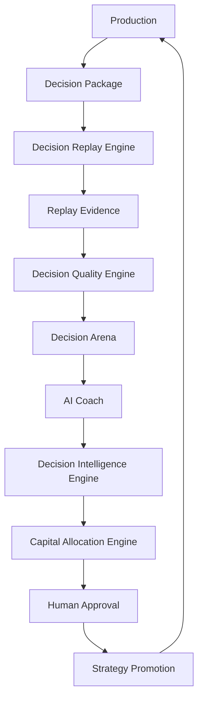

# DECISION_REPLAY_ENGINE.md

## OmniTrade Legacy Engine - Decision Replay Engine

### Status: Tier-1 Architecture Specification

The Decision Replay Engine is a core architectural subsystem of OmniTrade's Decision Intelligence Platform.

It is the formal bridge between:

Production

-> Decision Records

-> Decision Intelligence

Its role is to transform immutable historical decisions into replayable learning opportunities.

It is not an execution engine.

It never drives production behavior.

It never consumes live market streams directly.

---

## Why Replay Exists

Traditional systems remember outcomes.

OmniTrade is designed to remember why decisions were made.

Replay exists to revisit historical decisions under identical information conditions and evaluate alternatives without affecting production.

This separation is foundational: production observes reality in real time, while replay studies already observed reality under strict historical integrity.

---

## 1. Architectural Intent

OmniTrade is designed to improve decision quality over time, not merely to execute trades.

That requires a durable way to revisit the exact moments where production made, rejected, or deferred decisions and ask:

Given exactly what production knew at that moment, what alternative action would another agent have selected, and with what expected quality?

The Decision Replay Engine exists to answer that question in a deterministic, reproducible, evidence-producing way.

It converts immutable decision memory into structured replay evidence that downstream intelligence components can evaluate.

---

## 2. Core Principle

Production is the source of truth.

The Decision Replay Engine is an observational consumer.

Implications:

- Production owns real-time ingestion, signal generation, risk gating, and execution pathways.
- Production artifacts are immutable inputs to replay.
- Replay never writes back into production control loops.
- Replay outputs are advisory evidence, not runtime commands.

This boundary is non-negotiable and protects safety, explainability, and governance.

---

## 3. Architectural Position

The Decision Replay Engine sits in the learning and analysis path, downstream of production and upstream of comparative and recommendation systems.



## Information Flow Contract

```text
Production
↓
Decision Package
↓
Decision Replay Engine
↓
Replay Evidence
↓
Decision Quality Engine
↓
Decision Arena
↓
AI Coach
↓
Decision Intelligence Engine
↓
Capital Allocation Engine
↓
Human Approval
↓
Strategy Promotion
↓
Production
```

Contract constraints:

- Information flows downward through this chain.
- Downstream components may consume evidence but must not mutate production state.
- The only permitted influence back into production is:

```text
Human Approval -> Strategy Promotion -> Production
```

### 3.1 Stage Purpose

1. Production
- Generates real operational decisions under existing execution and risk controls.
- Produces immutable evidence artifacts.

2. Decision Package
- Canonical replay input assembled from immutable production artifacts.
- Defines what was knowable at decision time.

3. Decision Replay Engine
- Reconstructs decision-time context deterministically.
- Runs replay candidates over the package.
- Emits replay outcomes and provenance evidence.

4. Decision Quality Engine
- Converts replay evidence into structured quality metrics.
- Measures quality, calibration, and risk-adjusted decision performance.

5. Decision Arena
- Visualizes and compares replay outcomes.
- Does not own replay computation.

6. AI Coach
- Interprets replay patterns and generates advisory recommendations.
- Identifies mistakes, strengths, and experiment candidates.

7. Decision Intelligence Engine
- Synthesizes replay outcomes, quality metrics, coach recommendations, and history.
- Produces strategic recommendations for human review.

8. Capital Allocation Engine
- Converts intelligence outputs into recommended paper allocations.
- Never auto-allocates live capital.

9. Human Approval
- Mandatory governance checkpoint.
- Accepts, modifies, or rejects recommendations.

10. Strategy Promotion
- Controlled promotion workflow under human authority.
- Promotion decisions may influence production only after explicit approval.

---

## 4. Decision Package (Canonical Replay Input)

A Decision Package is the canonical replay input contract.

The Decision Replay Engine consumes Decision Packages, never live market streams.

### 4.1 Definition

A Decision Package is an immutable bundle of artifacts representing what production knew, decided, and recorded at a specific decision point.

### 4.2 Required and Optional Contents

A package includes, where available:

- Decision Record
- Decision Snapshot
- Signal
- Strategy metadata
- Risk evaluation
- Explainability record
- Market context
- Feature values
- Confidence
- Ground truth (later)
- Counterfactual results (later)

### 4.3 Decision Package Structure

```text
Decision Package
├── Market Memory
│   ├── candles
│   ├── features
│   └── indicators
├── Strategy Memory
│   ├── signal
│   ├── confidence
│   └── parameters
├── Risk Memory
│   ├── risk evaluation
│   └── position sizing
├── Explainability Memory
│   ├── decision record
│   └── explanation
└── Outcome Memory
    ├── ground truth
    └── counterfactuals
```

### 4.4 Packaging Rules

- Artifacts are version-pinned and lineage-preserving.
- Package identity is deterministic and hashable.
- Package content is append-only at the platform level; no in-place mutation.
- Missing fields are explicit and state-tagged as unknown or unavailable.

### 4.5 Why This Contract Exists

Without a canonical package boundary, replay can drift into undocumented data dependencies, accidental live coupling, or non-reproducible behavior.

The Decision Package enforces replay discipline.

---

## 5. Replay Philosophy and Semantics

Replay asks:

Knowing exactly what production knew at this moment, what would another agent have done?

### 5.1 Determinism

Replay is deterministic for the same package, replay candidate, and engine version.

Determinism requires:

- Immutable package inputs
- Stable tie-break rules
- Versioned scoring and replay logic
- Deterministic ordering of candidate execution

### 5.2 Historical Integrity

Replay never changes history.

- It does not rewrite production records.
- It does not alter original decision outcomes.
- It emits new evidence records linked to original lineage.

### 5.3 Evidence Production

Replay outputs are evidence artifacts, not operational actions.

Each replay result includes:

- candidate identity
- replay outcome
- metric-ready fields
- provenance
- deterministic replay hash

## Replay Contract

Replay is a pure function.

Given:

- Decision Package
- Replay Agent
- Replay Engine Version

Produce:

- Replay Evidence

Without:

- side effects
- production mutation
- package mutation
- live market reads

## Replay Evidence (Formal Term)

Replay Evidence is the immutable output of replay.

It is consumed by:

- Decision Quality Engine
- Decision Arena
- AI Coach
- Decision Intelligence Engine

Replay Evidence is advisory and analytical only; it is never an execution command.

---

## 6. Decision Replay Engine Responsibilities

The Decision Replay Engine is responsible for:

- selecting replay candidates for a Decision Package
- reconstructing decision-time context from package artifacts
- executing deterministic replay evaluation
- emitting replay evidence with immutable lineage
- exposing replay results for downstream quality and comparison systems

It is not responsible for:

- production execution
- signal generation in production runtime
- live market ingestion
- autonomous recommendations
- promotion or deployment decisions

---

## 7. Decision Quality Engine (Separate Component)

The Decision Quality Engine is a distinct architectural component downstream of replay.

Its role is measurement, not recommendation.

### 7.1 Responsibility

Transform replay evidence into structured quality metrics.

### 7.2 Example Metric Families

- calibration
- confidence accuracy
- risk-adjusted quality
- opportunity cost
- drawdown quality
- explanation quality
- counterfactual score

### 7.3 Explicit Boundary

The Decision Quality Engine does not make recommendations.

It produces measurable, comparable quality signals for downstream consumers.

---

## 8. Decision Arena (Computation vs Visualization)

Architectural distinction:

- Decision Replay Engine = backend computation
- Decision Arena = visualization and comparison UI

Arena does not own replay computation.

The Decision Arena never performs replay computation.

The Decision Arena displays and compares evidence.

Arena consumes replay and quality outputs, then presents comparative views for analysis and human review.

This separation preserves:

- backend determinism
- UI independence
- clear audit boundaries

---

## 9. AI Coach Role

The AI Coach consumes replay and quality outputs.

Responsibilities:

- identify recurring mistakes
- identify successful patterns
- summarize behavior
- recommend experiments
- recommend strategy promotion
- recommend retirement

AI Coach outputs are advisory only.

The AI Coach never applies autonomous strategy changes.

---

## 10. Decision Intelligence Engine Role

The Decision Intelligence Engine is the synthesizer.

It evaluates many replay results across time and context and combines:

- quality scores
- replay outcomes
- coach recommendations
- historical evidence

It produces strategic recommendations for governed decision-making.

It does not bypass human authority.

---

## 11. Capital Allocation Engine Role

The Capital Allocation Engine consumes Decision Intelligence outputs.

It produces recommended paper allocations.

It never allocates live capital automatically.

It remains downstream of quality evidence, replay evidence, and governance checks.

---

## 12. Governance and Safety Constraints

The following constraints are absolute:

- No autonomous strategy promotion.
- No autonomous code modification.
- No autonomous deployment.
- No live execution initiated by replay outputs.
- Human approval is mandatory for promotion and operational impact.

These constraints preserve safety boundaries between learning and execution.

---

## 13. Design Principles

The Decision Replay Engine is governed by the following principles:

- Production is sacred.
- Replay is observational.
- Memory is immutable.
- Learning is evidence-driven.
- AI advises.
- Humans govern.
- Every recommendation must be explainable.
- Historical replay must be deterministic.
- Replay must remain reproducible years later.

### 13.1 Architectural Rationale

These principles are not stylistic preferences.

They exist to prevent architectural drift toward unsafe autonomy, opaque model behavior, or non-reproducible historical analysis.

---

## 14. Version 1 Scope

Initial implementation scope:

Decision Records

-> Replay Candidates

-> Replay Engine

-> Arena visualization

-> AI Coach

### 14.1 V1 Goals

- Establish canonical Decision Package ingestion
- Enable deterministic replay for selected candidates
- Expose replay evidence for comparative visualization
- Support coach-level advisory pattern extraction

### 14.2 V1 Non-Goals

- autonomous learning loops
- autonomous promotion
- autonomous deployment
- live execution pathways

---

## 15. Future Expansion (Non-Implementing)

Future architectural evolution may include:

- 3 competing agents
- 10 competing agents
- agent leagues
- replay tournaments
- institutional memory expansion
- continuous learning systems
- replay benchmarking frameworks
- capital evolution policies
- cross-domain decision intelligence

These are future extensions to the same core principle:

Production remains the source of truth.

Replay remains an observational consumer.

---

## 16. Data and Reproducibility Model

To remain reproducible over long horizons, replay artifacts should be treated as versioned evidence.

### 16.1 Reproducibility Requirements

- immutable package identifiers
- deterministic replay hashes
- engine version pinning
- metric model version pinning
- explicit unknown or unavailable states

### 16.2 Long-Horizon Stewardship

A replay produced years later from the same package and version set should yield the same result.

If any result differs, the difference must be attributable to explicit version changes, not hidden runtime dependencies.

---

## 17. Anti-Patterns (Explicitly Rejected)

The following patterns are architecturally invalid:

- Replay reading live candles during historical replay
- Arena UI owning replay computation logic
- Replay outputs directly changing production strategy behavior
- Quality scoring modules emitting promotion commands
- Coach recommendations auto-executing in production

Rejecting these anti-patterns protects the production-replay separation contract.

---

## 18. Summary

The Decision Replay Engine is the platform's controlled mechanism for turning immutable production memory into structured replay evidence.

It does not execute.

It does not control production.

It does not govern itself.

It enables a governed learning loop where:

- production generates truth
- replay generates evidence
- quality measures evidence
- arena visualizes evidence
- coach interprets evidence
- intelligence synthesizes evidence
- capital allocation recommends from evidence
- humans decide

This is the architectural foundation for long-horizon, explainable, non-autonomous decision improvement.

---

Production exists to observe reality.

Replay exists to understand reality.

Intelligence exists to improve future decisions.

Humans remain responsible for changing production.
