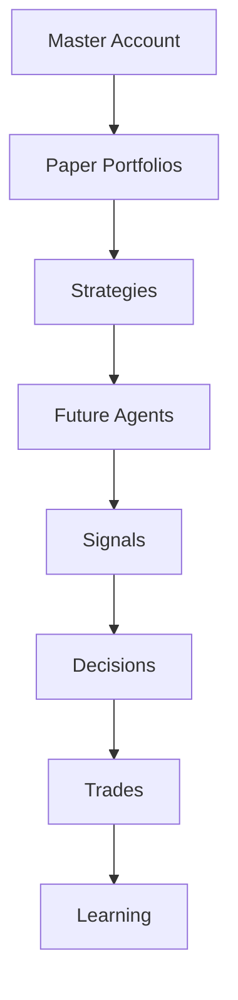
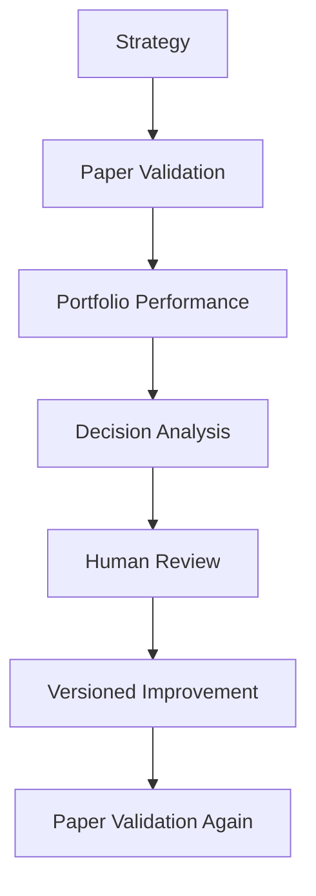

# OmniTrade Legacy Engine — Master Product Roadmap

## Purpose

This document is the platform-level architectural roadmap for OmniTrade. It defines the long-term structure and intended evolution of the system independently from implementation sequencing, so architecture remains stable as phases change (`PROJECT_CONSTITUTION.md` Article VI, `docs/adr/ADR-0001-four-core-engines.md`).

## 1. Vision

OmniTrade is a **Decision Intelligence Platform** whose first applied domain is investing and trading.

Trading is the initial proving domain, not the terminal identity of the platform. The long-term mission is to improve decision quality through:

- Explainability of every material decision.
- Structured experimentation with measurable outcomes.
- Disciplined validation before any real-capital deployment.

This direction aligns with `PROJECT_VISION.md`, `PROJECT_CONSTITUTION.md`, and `DECISION_INTELLIGENCE_ENGINE.md`.

## 2. Core Principles

The platform is guided by the following permanent principles:

- **Decision quality over profit:** short-term outcomes never replace disciplined reasoning (`PROJECT_CONSTITUTION.md` Article V).
- **Explainability first:** no opaque decision path is acceptable (`PROJECT_CONSTITUTION.md` Article I).
- **Auditability:** state-changing behavior must remain reviewable and attributable (`PROJECT_VISION.md` §4).
- **Human approval over automation:** high-impact transitions require explicit human consent (`PROJECT_VISION.md` §4).
- **Small Account Challenge:** the $25 starting-balance proving ground is a first-class design constraint (`SMALL_ACCOUNT_MODE.md`).
- **Capital stewardship:** capital preservation and safety controls are non-negotiable (`PROJECT_CONSTITUTION.md` Article VIII).
- **Portfolio-first architecture:** capital is managed through portfolios rather than ad hoc per-strategy assignment (ADR-0008).
- **Versioned evolution instead of self-modification:** strategies and agents evolve through explicit, reviewable versions, never silent rewrites (ADR-0008, `DECISION_INTELLIGENCE_ENGINE.md`).

## 3. Permanent Core Engines

Per ADR-0001, OmniTrade has exactly four permanent foundational engines:

1. **Market Intelligence**
2. **Strategy Evolution**
3. **Portfolio Intelligence**
4. **Decision Intelligence**

No additional foundational engine is introduced by this roadmap. New capabilities are implemented as subsystems inside one of these four engines.

## 4. Major Platform Subsystems

### Portfolio Intelligence Subsystems

Portfolio Intelligence includes:

- Paper Trading
- Portfolio Accounting
- Performance Analytics
- Capital Allocation Engine
- Small Account Challenge

### Decision Intelligence Subsystems

Decision Intelligence includes:

- Decision Records
- Decision Snapshot
- Counterfactual Outcome Ledger
- Decision Quality Engine
- AI Review
- Lessons Learned

### Cross-Cutting Governance Components

- **Risk Engine:** the universal safety gatekeeper for signals, sizing, and execution authority (`SYSTEM_ARCHITECTURE.md`, `PROJECT_CONSTITUTION.md` Article VIII).
- **Live Trading:** a deployment stage and operating mode, not a foundational engine.

## 5. Platform Dependency Hierarchy

Interpretation:

- Portfolios own capital.
- Agents operate within portfolios.
- Strategies and agents do not own master capital directly.
- Learning is downstream of decision and trade evidence.

## 6. Capital Allocation Engine

ADR-0008 defines the Capital Allocation Engine as a permanent subsystem of Portfolio Intelligence, not a fifth foundational engine (`docs/adr/ADR-0008-capital-allocation-engine.md`).

Its intended long-term responsibilities include:

- Allocating capital to portfolios first.
- Allocating portfolio capital to future agents within those portfolios.
- Rebalancing and recommendation generation.
- Allocation-history traceability for stewardship and audit.

Authority boundaries:

- It produces recommendations and governed allocation actions.
- It never bypasses the Risk Engine.
- It never bypasses required human approvals.

## 7. Decision Arena

The Decision Arena is a long-term comparative evaluation environment where strategies and future agents are assessed within portfolio context.

Agents compete within portfolios, not directly at the master-account layer.

Evaluation is multi-dimensional, including:

- Profit
- Drawdown
- Fee Drag
- Consistency
- Risk Discipline
- Decision Quality
- Explainability

Profit alone never determines the winner.

## 8. Learning Lifecycle

Example version progression:

Trend Hunter v1  
↓  
Trend Hunter v2

Strategies and agents never rewrite themselves automatically. Evolution is explicit, versioned, and human-governed.

## 9. Human Approval Gates

The following transitions always require explicit human approval:

- Promotion to live trading.
- Allocation of real capital.
- Agent promotion.
- Strategy promotion.
- Material allocation changes.
- Risk policy changes.

These gates exist to preserve safety, accountability, and architectural intent across phases.

## 10. Phase Roadmap

The implementation sequence is:

1. Phase 1 Infrastructure
2. Phase 2 Strategy Framework
3. Phase 3 Backtesting
4. Phase 4 Research Workspace
5. Phase 5 Portfolio Intelligence + Paper Execution Foundation
6. Phase 6 Risk Engine
7. Phase 7 Decision Intelligence Foundation
8. Phase 8 Decision Arena
9. Future Live Trading

This sequence describes implementation order only. It does not imply architectural importance beyond the permanent four-core-engine model.

## 11. Long-Term Vision

Over time, OmniTrade evolves from trading-focused decision support into a generalized Decision Intelligence Platform that can support additional domains beyond markets.

What remains invariant across domains:

- Explainable decision pathways.
- Auditable evidence trails.
- Human-approved high-impact transitions.
- Versioned, non-self-modifying evolution.
- Safety-gated operational control.

This preserves continuity with `PROJECT_CONSTITUTION.md`, ADR-0001, and ADR-0008 while allowing domain expansion without architectural drift.
