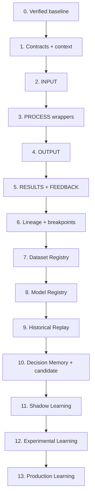

# OmniTrade Pipeline and Learning Implementation Plan

Version: 1.0

Status: Governing implementation roadmap

Owner: OmniTrade Architecture

Governing dependencies:

- `PIPELINE_ARCHITECTURE.md`
- `LEARNING_INTELLIGENCE_ARCHITECTURE.md`
- `PROJECT_CONSTITUTION.md`
- `PROJECT_VISION.md`
- `SYSTEM_ARCHITECTURE.md`
- `DECISION_INTELLIGENCE_ENGINE.md`
- `RISK_ENGINE.md`
- current architectural decisions, project state, and operations map

This document implements the two governing architectures as layered responsibilities. It does not supersede or reinterpret their philosophy. Where an older planning document conflicts with verified production behavior, current production evidence and the governing architectures control.

---

# 1. Executive Summary

OmniTrade will migrate by **encapsulation, evidence capture, and controlled convergence**, not by replacement or a big-bang rewrite.

The existing production system already performs many of the required transformations: market ingestion, strategy evaluation, economics, Risk, mandate and campaign governance, package construction, provider submission, order supervision, reconciliation, accounting, Decision Record creation, controlled proving, and portions of replay. The migration must preserve those behaviors while making their currently implicit boundaries explicit.

The implementation sequence is:

```text
Current production behavior
    ↓
Verified architectural inventory
    ↓
Versioned canonical contracts and execution context
    ↓
INPUT wrappers and immutable raw evidence
    ↓
PROCESS stage wrappers around existing logic
    ↓
Canonical OUTPUT assembly
    ↓
RESULTS evaluation and FEEDBACK candidates
    ↓
Immutable end-to-end lineage and audit breakpoints
    ↓
Dataset and model registries
    ↓
Same-pipeline Historical Replay
    ↓
Decision Memory and training examples
    ↓
Candidate models and Decision Arena
    ↓
Shadow Learning
    ↓
Experimental Learning
    ↓
Governed Production Learning
```

The production path remains authoritative throughout migration. New contracts begin in observe-only mode, are populated beside existing records, and are compared against existing outcomes. A contract wrapper may become authoritative only after parity is demonstrated. Existing Risk and Governance calls remain in their current positions and retain veto authority. No learning component receives production execution authority merely because it is trained, replay-tested, or operationally successful.

The first major delivery is not a learning model. It is a learning-ready production pipeline that can prove, for every material cycle, the exact raw evidence, canonical inputs, transformations, versions, authorizations, execution reality, accounting result, and feedback candidate.

## 1.1 Migration rules

1. Preserve the current live path until replacement parity is proven.
2. Wrap before refactoring; refactor only behind stable contracts.
3. Replace only when an existing component cannot satisfy a governing invariant without unsafe coupling.
4. Add fields and tables append-only where practical; never rewrite immutable evidence.
5. Introduce one authoritative contract boundary at a time.
6. Use in-process interfaces first. Add HTTP, queues, or separate services only for an operationally demonstrated need.
7. Require deterministic shadow comparison before changing authority.
8. Keep replay, shadow, paper, experimental, and production persistence structurally isolated.
9. Preserve Risk, mandate, campaign, operator, and kill-switch authority in every operating mode.
10. Make every rollback a routing/configuration rollback, not a historical-data rollback.

## 1.2 Definition of migration safety

A migration phase is production-safe only when:

- default-disabled behavior is identical to the pre-phase path;
- new evidence writes cannot block or mutate production decisions unless the phase explicitly promotes them;
- failures in optional evidence capture fail visibly without creating a second execution path;
- any promoted stage fails closed;
- old and new outcomes can be correlated by stable identifiers;
- rollback does not require deleting evidence or reversing completed trades;
- Risk and Governance outcomes remain at least as restrictive as before;
- production reconciliation and accounting remain the final authority on external reality.

---

# 2. Assessment Basis and Verification Boundary

This roadmap is based on the supplied governing documents, repository specifications, current Project State, Architectural Decisions, and Operations Map. Those sources establish the major deployed modules and verified production capabilities. The live application source tree was not included in the implementation-planning workspace, so file-level mapping below is authoritative as a roadmap but must be confirmed by a bounded read-only repository inventory before Phase 1 implementation begins.

This is not permission to reopen settled production investigations. Source verification should confirm contract seams, writes, imports, clocks, and identifiers—not redesign established behavior.

Evidence classifications used below:

- **Existing:** repository or production documentation identifies the capability.
- **Partial:** the capability exists but does not yet satisfy all canonical, lineage, isolation, or same-pipeline requirements.
- **Planned:** architecture describes it, but supplied evidence does not establish implementation.
- **Verify:** source-level confirmation is required before changing authority.

---

# 3. Current Repository Assessment

## 3.1 Repository-level mapping

| Repository area / capability | Pipeline stage | Current fit | Migration disposition | Rationale and target |
| --- | --- | --- | --- | --- |
| `app/services/data/kraken_client.py`, `binance_client.py`, provider market-data clients | INPUT / raw acquisition | Partial | **Wrap**, then narrowly refactor | Preserve exact provider payload and transport metadata before current normalization. Provider clients remain adapters. No provider schema may escape normalization. |
| Existing candle persistence and asset registry | INPUT / canonical admission | Partial | **Evolve** | Existing numeric precision, asset IDs, source, and idempotent candle storage are valuable. Add stable instrument identity, `occurred_at`, truthful `available_at`, raw lineage, schema version, quality status, and revision semantics. Do not rebuild candle history. |
| `app/services/asset_commissioning/service.py` and `asset_roster.py` | INPUT readiness / Governance support | Strong but specialized | **Wrap** | Keep the seven-stage commissioning flow and bounded roster. Emit canonical readiness/admission evidence; do not turn commissioning into normalization or strategy logic. |
| `app/services/orchestration/continuous_pipeline_worker.py` | PROCESS orchestration | Existing, high concentration of responsibility | **Wrap first; progressively thin** | It remains the production conductor initially. Extract semantic stage calls behind in-process interfaces while preserving ordering, idempotency, retry, and supervision. It should eventually orchestrate rather than perform stage logic. |
| `app/services/strategies/` and strategy registry | PROCESS: Strategy | Strong foundation | **Wrap; do not replace** | Pure strategy interfaces, provider neutrality, explanations, and versioned parameters already align. Adapt input/output to canonical feature and strategy-evaluation contracts. |
| Regime classifiers, filters, AI scoring, allocator / `app/services/ai*` | PROCESS: Market Intelligence, Feature Engineering, advisory intelligence | Partial | **Classify, wrap, then separate responsibilities** | Preserve existing deterministic and AI capabilities. Make feature snapshots immutable. Distinguish regime construction, feature calculation, confidence scoring, and capital recommendation as separate outputs. AI remains advisory. |
| Existing economics checks in autonomous cycle/package preparation | PROCESS: Economics | Existing | **Wrap; consolidate only after parity** | Create a `CanonicalEconomicEvaluation` around current fee, spread, slippage, minimum, and expected-net logic. Do not create a competing economics calculator. |
| Candidate selection and `authoritative.py` deterministic ranking | PROCESS: Portfolio Opportunity Arbitration / Decision | Existing | **Wrap** | Preserve deterministic ranking and “at most one winner” behavior. Emit allocation and deferral evidence, including `why_not_other_assets`. |
| `app/services/risk/risk_engine.py` and risk rules | PROCESS: Risk | Existing and authoritative | **Wrap only initially** | Preserve decision math, ordering, veto/resize/delay behavior, and kill switches. Give it canonical inputs and emit a canonical Risk decision without weakening current authority. Refactor internals only in a separate, evidence-backed phase. |
| `capital_campaign_domain/`, `canonical_campaign_binding.py`, `mandates/` | PROCESS: Governance | Existing and authoritative | **Wrap; do not replace** | Campaign definitions, runtime version pins, mandate versions, commissioning evidence, and explicit scopes become inputs to a canonical Governance decision and Authorization. Existing authority remains source of truth. |
| Controlled Proof and Exit Recovery | Governance / controlled operating context | Existing | **Evolve as an operating mode**, not a second pipeline | Preserve proof-specific API, idempotency, expiry, recovery claims, and terminal evidence. Route proof execution through the same stage contracts with `CONTROLLED_PROOF` context. |
| Ready-package construction and automatic package progression | PROCESS: Execution package construction | Existing | **Wrap** | Existing READY → AUTHORIZED → DRY_RUN_PASSED → ACTIVATED lifecycle becomes canonical execution-package evidence. Preserve package IDs and state machine. |
| `commissioned_entry_execution.py`, exchange provider adapters (`kraken_spot.py`, `coinbase_advanced.py`) | PROCESS: Provider | Existing | **Wrap; do not generalize prematurely** | Retain provider-neutral execution and idempotency. Canonical packages translate to provider orders only inside adapters. Provider results normalize immediately after receipt. |
| Execution claims and `autonomous_execution_claims.py` | PROCESS: Governance-to-execution custody | Existing | **Wrap** | Preserve claim ownership and idempotent custody transfer. Add explicit causation and authorization references. |
| Open-order/package supervision and recovery | PROCESS: Open Order Management | Existing, distributed | **Refactor behind a single semantic boundary after wrapping** | Keep current self-healing behavior. Consolidate lifecycle state interpretation only after all current retries, partial states, and failure codes are inventoried. |
| Position lifecycle / autonomous exit management | PROCESS: Position Lifecycle | Existing | **Wrap** | Emit `CanonicalPositionLifecycleDecision`; every exit re-enters Risk and Governance. Never let lifecycle management call a provider directly. |
| Live reconciliation events and terminal recovery scheduler | PROCESS: Reconciliation | Existing and production-proven | **Wrap; preserve finality policy** | Emit canonical reconciliation results without rewriting execution intent. Preserve external historical-order provenance classification and immutable newer terminal events. |
| Production accounting framework and ownership projection | PROCESS: Accounting / OUTPUT | Existing | **Wrap; verify atomicity and idempotency** | Emit canonical accounting result and portfolio snapshot. Accounting remains based on reconciled truth, not model predictions. |
| `app/models/decision_record.py`, `app/services/decisions/` | OUTPUT / Episodic Memory | Existing, partial | **Evolve; do not rebuild** | Expand Decision Records/Snapshots to reference canonical stage evidence and versions. Preserve existing IDs and immutable records. Use additive links/backfill manifests rather than rewriting history. |
| `app/services/replay/`, `decisions/replay_context.py`, `replay_candidates.py` | Historical Replay | Existing, partial | **Converge onto the live stage contracts** | Keep replay capabilities, but prove the same post-normalization business functions are invoked. Remove or retire duplicated backtest-only business decisions only after parity. |
| Backtesting engine and fill simulator | Replay / research | Existing, partial | **Adapt, not discard** | Preserve research UI, metrics, and simulation components. Recast it as a replay client/execution-fidelity adapter. Any duplicated strategy/Risk/economics logic must converge on canonical stages. |
| `SimulationBase`, `OT_SIMULATION_DATABASE_URL`, `IsolationGuard` | Replay isolation | Existing foundation | **Strengthen and make mandatory** | No fallback to production. Add mode-bound credentials, startup assertions, transaction-level guards, and isolation tests. |
| `model_outputs` and AI explanations | OUTPUT evidence / early Model Registry evidence | Existing, partial | **Evolve** | Preserve inputs, outputs, model name/version, and explanations. Link them to immutable model registry versions and canonical features/datasets. |
| Counterfactual Outcome Ledger and Decision Quality concepts | RESULTS / Decision Memory | Planned or partial; verify | **Evolve existing work if present** | COL evaluates alternate actions; DQE evaluates decision quality. Neither becomes a second replay engine or live authority. |
| Audit log and structured runtime logs | Cross-cutting evidence / observability | Existing | **Augment, not replace** | Separate immutable business audit from operational telemetry. Add stage-run evidence, version pins, hashes, lineage edges, and retention policy. |
| FastAPI routes and operator CLI | Inspection, simulation, governed mutation interfaces | Existing | **Add interfaces selectively** | Prefer read-only lineage/run inspection first. Stage execution stays in-process. Add simulation endpoints only after isolation. No endpoint may become an alternate authority path. |
| Next.js frontend | Operator inspection and governance | Existing | **Evolve after backend evidence contracts** | Add run lineage, stage breakpoints, dataset/model status, shadow comparisons, and promotion evidence. The UI never becomes a source of business truth. |
| Alembic migrations / Postgres | Persistence | Existing | **Evolve additively** | Add immutable canonical/evidence/registry tables in bounded migrations. Avoid destructive column reinterpretation. Partition only after measured need. |
| systemd API and orchestration services | Deployment | Existing | **Keep deployment stable initially** | Contract design does not require new services. Resolve configuration-source ambiguity separately before relying on mode flags for learning isolation. |

## 3.2 Stage compliance summary

| Stage | Already present? | Main gap before architectural compliance |
| --- | --- | --- |
| INPUT | Yes | Immutable raw payloads, truthful availability time, explicit normalization/validation separation, quarantine, canonical versioning |
| PROCESS | Yes | Explicit stage boundaries, versioned I/O, immutable snapshots, injected context/clock, independent replayability |
| OUTPUT | Yes, distributed | One terminal output package linking decision, execution, reconciliation, accounting, audit, explanation, and lineage |
| RESULTS | Partial | Governed evaluation of the complete journey distinct from P&L; delayed outcome and counterfactual resolution |
| FEEDBACK | Partial/conceptual | Immutable candidates, review states, promotion evidence, and strict non-authority by default |
| Dataset Registry | Not established | Immutable dataset identity, manifests, lineage, quality, and consumption links |
| Model Registry | Partial via `model_outputs`/versions | Immutable model assets, lifecycle, validation, promotion, retirement, and feature/dataset links |
| Historical Replay | Yes, partial | Proven same-pipeline execution, temporal integrity, fidelity declarations, isolated persistence |
| Decision Memory | Yes, partial | Complete stage lineage, outcomes, counterfactuals, lessons, and searchable training-example projection |
| Shadow Learning | Not established as governed capability | Zero-authority live candidate evaluation and outcome comparison |
| Experimental Learning | Planned | Ring-fenced portfolio, immutable budget, explicit mandate and termination controls |
| Production Learning | Not established | Governed promotion of immutable intelligence; no silent retraining or self-promotion |

## 3.3 Replacement policy

No major current production module is assumed to require immediate replacement.

Replacement is justified only if, after wrapping and parity testing, a component:

- cannot consume or produce a stable canonical contract;
- cannot preserve deterministic/replayable behavior without hidden external state;
- duplicates an authoritative business decision and cannot be converged safely;
- violates production/replay isolation structurally;
- mutates evidence that must be immutable; or
- combines responsibilities so tightly that defects cannot be localized or rolled back.

Even then, replacement occurs stage-by-stage behind the same contract, with old/new comparison and a reversible authority switch.

---

# 4. Pipeline Migration

The five macro stages are introduced in their governing order: **INPUT, PROCESS, OUTPUT, RESULTS, FEEDBACK**. This order minimizes risk because no downstream abstraction is made authoritative before the evidence it depends on is stable.

## 4.1 INPUT first

INPUT is introduced first because every later replay, model, explanation, and audit conclusion is only as trustworthy as admitted evidence.

Implementation order inside INPUT:

1. Common canonical envelope and stable asset/instrument identity.
2. Execution Context separated from business data.
3. Immutable raw-provider evidence capture.
4. Provider normalizers producing versioned canonical contracts.
5. Independent validators producing ACCEPTED, QUARANTINED, or REJECTED.
6. Admission boundary permitting only ACCEPTED objects into decision-making.
7. Compatibility adapters that produce the current candle/portfolio/config shapes unchanged for existing consumers.

Safety mechanism: canonical capture begins observe-only. The current production objects continue to drive decisions until normalized parity is proven for each provider and contract family.

## 4.2 PROCESS second

PROCESS is wrapped only after INPUT identity and timestamps are stable.

Implementation order inside PROCESS:

1. Market Intelligence.
2. Feature Engineering.
3. Strategy.
4. Economics.
5. Portfolio Opportunity Arbitration.
6. Decision.
7. Risk.
8. Governance.
9. Execution package construction.
10. Provider translation and result normalization.
11. Open Order Management.
12. Position Lifecycle, with actions re-entering Risk and Governance.
13. Reconciliation.
14. Accounting.
15. Knowledge capture.

Each step first records current function inputs and outputs in a stage envelope. Business logic is not moved until parity tests show the wrapper is semantically transparent. Risk and Governance wrappers are deliberately late in the processing sequence so upstream contracts are stable before touching the most safety-critical boundaries.

## 4.3 OUTPUT third

OUTPUT is introduced after the terminal process stages emit stable evidence.

Create a canonical terminal package that references, rather than duplicates:

- terminal decision and reason;
- Risk and Governance decisions;
- authorization evidence;
- execution package/order lifecycle;
- reconciliation result;
- accounting result and resulting portfolio snapshot;
- Decision Record/Snapshot;
- audit and observability references;
- version manifest and lineage root;
- completion, blocked, deferred, quarantined, or failed status.

OUTPUT does not wait forever for asynchronous economic outcomes. It distinguishes pipeline terminality from later RESULTS maturity. For example, a HOLD can be terminal immediately; a BUY output can be pipeline-terminal while its position outcome remains unresolved.

## 4.4 RESULTS fourth

RESULTS evaluates completed OUTPUT without changing how the output was produced.

Introduce:

- outcome observation windows;
- execution-quality evaluation;
- reconciliation/accounting correctness evaluation;
- decision-quality evaluation distinct from profit;
- counterfactual evaluations with explicit fidelity;
- operator review (“Do I love this?”) as immutable, versioned evidence;
- result maturity states: PENDING, PARTIAL, RESOLVED, INVALIDATED_BY_EVIDENCE;
- evaluation/version lineage.

RESULTS never rewrites the Decision Record or original output. It appends newer evaluations.

## 4.5 FEEDBACK fifth

FEEDBACK is introduced only after RESULTS can distinguish luck, quality, safety, and operational reliability.

Feedback objects may recommend changes to:

- data sources, normalization, validation;
- features, strategy parameters, models, economics assumptions;
- execution behavior;
- explanations and observability;
- Risk or Governance policy, subject to separate constitutional approval.

Every feedback candidate is immutable, has evidence links and a disposition, and begins with zero production authority. Acceptance creates a new versioned configuration, policy, feature, strategy, dataset, or model candidate. Promotion requires replay, stress testing, review, and explicit authorization.

---

# 5. Learning Migration

Learning is built on completed pipeline milestones and never becomes a parallel decision path.

## 5.1 Dataset Registry

Pipeline dependency:

- canonical INPUT contracts are stable;
- lineage from raw evidence through stage outputs exists;
- OUTPUT/RESULTS maturity is explicit;
- quality and replay fidelity are representable.

Introduce an immutable Dataset Registry before mass replay or training. Initially it can register small manually/materially assembled datasets and manifests; it need not contain a data lake.

Required capabilities:

- dataset ID and immutable version;
- source manifest containing canonical object/run IDs;
- contract, feature, label, policy, and code versions;
- asset/date scope, `available_at` policy, evidence quality, fidelity, integrity hash;
- build status and validation report;
- links to consuming training runs/models;
- supersession without mutation.

## 5.2 Model Registry

Pipeline dependency:

- Dataset Registry schema exists;
- current AI/model outputs have stable feature/version identity;
- canonical stage output can reference `model_version` without granting authority.

Introduce the Model Registry as an asset and lifecycle registry before training the first new candidate. Register current deterministic/AI baselines where meaningful; do not falsely relabel strategies as trained models.

Required capabilities:

- immutable model/version identity and artifact hash;
- architecture, feature, dataset, loss, optimizer, training-run, and validation links;
- explanation/calibration contract;
- states for candidate, validation, replay, arena, shadow, paper, controlled proof, production candidate, production, retired;
- promotion history and authority scope;
- no mutable “current model” file without a versioned registry pointer.

## 5.3 Historical Replay

Pipeline dependency:

- INPUT and PROCESS stage contracts are callable;
- Execution Context and injected clock are enforced;
- lineage and OUTPUT assembly work in non-live modes;
- isolated persistence and simulated provider adapters fail closed;
- Dataset/Model Registries can identify replay inputs and model versions.

Converge existing replay and backtesting onto the canonical post-normalization business stages. Implement two explicit meanings: historical-as-originally-understood and modern-policy replay. Declare fidelity levels and prevent future leakage through `available_at`.

Replay produces pipeline evidence, not merely P&L metrics.

## 5.4 Decision Memory

Pipeline dependency:

- replay can generate complete OUTPUT and RESULTS evidence;
- live Decision Records link to the same stage contracts;
- counterfactual evaluation versions and horizons are explicit.

Evolve existing Decision Records, snapshots, model outputs, controlled proofs, and replay evidence into episodic memory. Build semantic projections—lessons, analogue indexes, calibration summaries—without mutating episodic evidence.

## 5.5 Candidate Models

Pipeline dependency:

- curated registry datasets exist;
- replay and Decision Memory can create stable training examples;
- baseline and evaluation metrics are versioned;
- explainability, calibration, uncertainty, and loss contracts exist.

Train one narrow candidate for one bounded responsibility. The recommended first candidate is **confidence calibration** for an existing deterministic strategy/ensemble, because it advises confidence without inventing a new execution path and can be judged with clear calibration metrics. It cannot bypass Risk or Governance.

## 5.6 Shadow Learning

Pipeline dependency:

- candidate passes offline validation, replay, stress tests, and Decision Arena;
- live canonical inputs are available;
- shadow outputs are isolated and marked zero-authority;
- outcome/result evaluation can compare shadow and production decisions.

Run the candidate on live canonical inputs beside production. It may write recommendations and explanations only. No provider, package, mandate, balance, production portfolio, or production accounting mutation is permitted.

## 5.7 Experimental Learning

Pipeline dependency:

- shadow criteria are met over defined regimes and duration;
- paper/controlled-proof evidence is satisfactory;
- a separate learning portfolio and immutable budget exist;
- campaign, mandate, Risk, Governance, kill switches, reconciliation, and accounting support explicit experimental scope.

Grant bounded live authority through an explicit experimental campaign. Capital, exposure, drawdown, daily loss, position size, holding time, termination conditions, and learning objective are immutable for the experiment. The model cannot enlarge them.

## 5.8 Production Learning

Pipeline dependency:

- experimental results demonstrate multi-dimensional superiority and operational reliability;
- promotion evidence is complete;
- human/governance approval identifies exact model and authority scope;
- rollback to the prior production model is tested;
- monitoring detects drift, novelty, and calibration failure.

Promote an immutable model version to Production Intelligence. Production may consume that intelligence through the existing pipeline. It may not silently retrain, promote, increase scope, or alter Risk/Governance.

---

# 6. Phase-by-Phase Roadmap

## Phase 0 — Freeze the baseline and verify the architectural inventory

**Purpose**

Establish the exact live pipeline, current writes, versions, clocks, identifiers, and authority boundaries before introducing contracts.

**Dependencies**

- Governing documents approved as implementation authority.
- Current production proving work remains independently operable.

**Repository areas**

- orchestration worker;
- autonomous cycle and ranking;
- data/provider clients;
- strategy, AI, economics, Risk;
- campaign, mandate, commissioning, controlled proof;
- package/claim/provider/order management;
- reconciliation/accounting;
- Decision Records/replay;
- migrations, configuration, runtime service entry points.

**Deliverables**

- verified current-stage inventory with file/function owners;
- call graph for one BUY, HOLD, SELL, controlled proof, recovery, and reconciliation cycle;
- table of current implicit input/output shapes and persistence writes;
- clock/environment/global-state inventory;
- identifier and idempotency map;
- baseline fixtures and golden production-safe test scenarios;
- explicit list of duplicate or bypass paths, without changing them.

**Acceptance criteria**

- every production mutation path reaches existing Risk and Governance where required;
- all provider submissions and accounting writes have identified call sites;
- existing live/replay shared and duplicated logic is classified;
- configuration ambiguity relevant to operating mode is documented;
- baseline tests reproduce current terminal outcomes and reason codes.

**Rollback boundary**

Read-only phase; no production change.

**Risks**

- stale docs mistaken for current behavior;
- missing dynamic call paths;
- accidental expansion into re-investigating resolved production defects.

**Future capabilities unlocked**

- safe contract placement;
- bounded implementation prompts;
- reliable parity testing.

## Phase 1 — Canonical contract and compatibility foundation

**Purpose**

Define semantic boundaries without changing business behavior.

**Dependencies**

- Phase 0 accepted.

**Repository areas**

- new in-process contract/envelope module;
- schemas;
- version manifest utilities;
- execution context;
- compatibility adapters;
- tests.

**Deliverables**

- canonical envelope v1;
- Execution Context v1 with injected clock;
- contract families prioritized for current BTC/Kraken path;
- stage result envelope with status/reason/explanation/hash;
- stable asset/instrument identity rules;
- serialization, hash, schema-version, and decimal/time policies;
- adapters from canonical objects to existing function inputs and back.

**Acceptance criteria**

- contracts serialize deterministically;
- business payload and execution context remain separate;
- exact decimal precision is preserved;
- unknown versions fail closed;
- no production consumer is switched;
- compatibility adapters reproduce baseline fixtures.

**Rollback boundary**

Remove/disable unused contract modules; existing tables and live routing remain untouched.

**Risks**

- giant universal object;
- premature contract breadth;
- version labels without semantic enforcement.

**Future capabilities unlocked**

- observe-only canonical capture;
- independent stage testing;
- eventual deployment independence.

## Phase 2 — INPUT: raw evidence, normalization, validation, and admission

**Purpose**

Make production inputs trustworthy, provider-neutral, replayable, and learning-ready.

**Dependencies**

- Phase 1 canonical envelope and identity rules.

**Repository areas**

- Kraken/Binance/other data clients;
- exchange/provider result adapters;
- assets/candles/balances/positions/config commands;
- Alembic migrations;
- quarantine/quality services.

**Deliverables**

- immutable raw record store and hashes;
- normalizers for current high-value families: candle, provider order/result/fill, balance, position, campaign/mandate snapshots;
- validators and quarantine records;
- explicit admission service;
- truthful `occurred_at`, `available_at`, `received_at`, and revision rules;
- observe-only dual capture and parity reports;
- legacy-shape compatibility outputs.

**Acceptance criteria**

- accepted canonical records trace to exact raw records;
- provider fields do not leak past normalizers;
- quarantined/rejected records cannot drive decisions;
- duplicate/conflicting records behave deterministically;
- replay-ineligible timestamps are downgraded/rejected according to policy;
- current production decisions remain unchanged during observe-only operation.

**Rollback boundary**

Disable canonical capture/admission authority and retain the old ingestion path; preserve already-written evidence.

**Risks**

- write amplification;
- incorrect availability timestamps;
- symbol identity collision;
- evidence capture affecting ingestion latency.

**Future capabilities unlocked**

- temporal-integrity replay;
- provider substitution;
- input-quality learning;
- precise defect localization.

## Phase 3 — PROCESS: wrap the existing business pipeline

**Purpose**

Make each existing transformation explicit and callable while preserving production behavior.

**Dependencies**

- Phase 2 accepted canonical inputs;
- Phase 1 Execution Context.

**Repository areas**

- market intelligence/features;
- strategies/AI/economics;
- ranking/arbitration/decision;
- Risk;
- campaign/mandate Governance;
- package construction/provider adapters;
- order and position lifecycle;
- reconciliation/accounting/knowledge;
- orchestration worker.

**Deliverables**

- versioned stage interfaces around current functions;
- immutable feature snapshots;
- canonical strategy/economics/allocation/decision/Risk/Governance outputs;
- authorization and package lineage;
- canonical provider and lifecycle results;
- canonical reconciliation/accounting outputs;
- side-by-side wrapper parity evidence;
- orchestrator changed only to call wrappers after each wrapper is proven.

**Acceptance criteria**

- baseline outcomes, order, reason codes, amounts, and authority are unchanged;
- every stage records exact inputs/outputs and versions;
- no business stage reads wall clock or environment directly when invoked with context;
- Risk and Governance remain mandatory and authoritative;
- position exits re-enter Risk and Governance;
- duplicate/retry behavior creates no duplicate execution.

**Rollback boundary**

Per-stage routing flag returns that stage to its legacy direct call; never one flag that bypasses multiple safety stages.

**Risks**

- wrappers accidentally recalculating values;
- changing exception/retry semantics;
- transaction boundaries shifting;
- orchestration worker becoming more complex before it becomes thinner.

**Future capabilities unlocked**

- stage breakpoints;
- independent replay;
- semantic service extraction if later justified.

## Phase 4 — OUTPUT: canonical terminal package and run closure

**Purpose**

Represent exactly what emerged from each complete pipeline cycle.

**Dependencies**

- Phase 3 terminal stages emit canonical evidence.

**Repository areas**

- Decision Records/Snapshots;
- package/order/reconciliation/accounting records;
- run registry;
- audit APIs.

**Deliverables**

- `CanonicalResultSummary`/terminal output package;
- pipeline run and stage-run records;
- explicit terminal statuses and asynchronous-result references;
- complete version manifest;
- read-only run inspection endpoint/query service.

**Acceptance criteria**

- every cycle, including HOLD/BLOCK/DEFER/FAIL, has a terminal package;
- package links to evidence instead of copying mutable snapshots;
- unresolved position outcome is distinguished from incomplete pipeline processing;
- terminal package can be reconstructed and hash-verified.

**Rollback boundary**

Stop terminal-package writes; existing production lifecycle remains authoritative.

**Risks**

- treating BUY/SELL as the whole output;
- indefinite runs due to asynchronous outcomes;
- duplicated sources of truth.

**Future capabilities unlocked**

- complete-journey evaluation;
- run-level audit UI;
- dataset manifests.

## Phase 5 — RESULTS and FEEDBACK foundation

**Purpose**

Evaluate complete journeys and create governed improvement candidates without changing production.

**Dependencies**

- Phase 4 output closure;
- reconciliation/accounting truth;
- immutable decision evidence.

**Repository areas**

- decisions/outcome tracking;
- counterfactual and quality services if present;
- AI coach/review;
- operator review APIs/UI;
- feedback persistence.

**Deliverables**

- result/evaluation records with maturity and evaluation version;
- outcome, execution, calibration, operational, and decision-quality dimensions;
- bounded COL/DQE implementation or convergence with existing components;
- operator review evidence;
- immutable feedback candidates and disposition workflow;
- explicit prohibition on automatic production mutation.

**Acceptance criteria**

- profitable bad decisions and disciplined losses can be distinguished;
- evaluations never alter original records;
- counterfactual fidelity and horizon are explicit;
- feedback starts with zero authority;
- any accepted feedback creates a new versioned candidate object.

**Rollback boundary**

Disable evaluators/feedback generation; preserve evidence already written. Production path is unaffected.

**Risks**

- hindsight bias;
- reward functions collapsing to profit;
- premature DQ scores before outcomes resolve;
- subjective operator labels without context/versioning.

**Future capabilities unlocked**

- trustworthy labels;
- institutional lessons;
- learning objective design.

## Phase 6 — End-to-end lineage, audit modes, and breakpoints

**Purpose**

Make the learning-ready pipeline provably causal and independently inspectable.

**Dependencies**

- Phases 2–5 produce canonical evidence.

**Repository areas**

- lineage store/index;
- stage runner;
- operator inspection API/CLI;
- observability;
- integrity verification.

**Deliverables**

- immutable lineage edges and integrity hashes;
- Audit Modes 1–9 with safe STOP boundaries;
- no-submit dry-run adapter;
- first-divergent-stage comparison;
- business-audit/operational-telemetry separation;
- retention and compaction policy preserving causal evidence.

**Acceptance criteria**

- one query traverses raw event → accounting → feedback;
- every stage exposes input/output/status/reason/version/hash/duration;
- STOP before provider submission is structurally enforced;
- controlled execution remains governed;
- hashes detect evidence mutation;
- audit mode cannot affect production unless explicitly operating under governed controlled execution.

**Rollback boundary**

Disable inspection runner/breakpoints; canonical evidence remains usable and live orchestration remains intact.

**Risks**

- high storage/latency overhead;
- confusing observability with audit truth;
- audit runner becoming an alternate mutation path.

**Future capabilities unlocked**

- deterministic debugging;
- replay certification;
- dataset provenance;
- safe stage extraction.

## Phase 7 — Dataset Registry

**Purpose**

Turn training/research data into immutable, governed architectural assets.

**Dependencies**

- Phases 2, 4, 5, and 6.

**Repository areas**

- new dataset registry/domain module;
- migrations;
- manifest builder;
- validation and inspection APIs.

**Deliverables**

- dataset/version schema;
- immutable source manifests;
- feature/label builders as projections from canonical evidence;
- quality, fidelity, temporal-integrity, and leakage reports;
- dataset-to-run/model links.

**Acceptance criteria**

- rebuilding from the same manifest is deterministic;
- corrections create new versions;
- no dataset with unresolved lineage is trainable;
- every row/example traces to canonical evidence and result version;
- production records are read, never mutated.

**Rollback boundary**

Stop dataset builds; registry is non-authoritative to production.

**Risks**

- hidden leakage in labels/features;
- mutable files outside registry;
- unbounded storage;
- low-quality replay treated as truth.

**Future capabilities unlocked**

- reproducible training;
- dataset comparison;
- learning-how-to-learn analysis.

## Phase 8 — Model Registry foundation

**Purpose**

Give current and future intelligence immutable identity, evidence, lifecycle, and authority scope.

**Dependencies**

- Phase 7 registry contract;
- stable model/feature output references from Phase 3.

**Repository areas**

- model registry/domain module;
- artifact storage abstraction;
- `model_outputs` linkage;
- promotion records.

**Deliverables**

- immutable model/version records;
- training/validation/evaluation links;
- lifecycle state machine;
- promotion and retirement evidence;
- authority scope separate from model status;
- registration of current baselines where truthful.

**Acceptance criteria**

- no unversioned model can produce an authoritative output;
- artifact hashes and feature contracts are verified on load;
- registry state does not itself grant execution authority;
- production pointer changes require governed promotion evidence.

**Rollback boundary**

Existing registered production logic remains selected; candidate registration can be disabled without changing decisions.

**Risks**

- registry pointer becoming an unsafe feature toggle;
- artifact/config drift;
- conflating deterministic strategies and trained models.

**Future capabilities unlocked**

- reproducible candidates;
- Decision Arena;
- safe rollback between model versions.

## Phase 9 — Same-pipeline Historical Replay

**Purpose**

Turn existing replay/backtesting into a certified experience factory using production business stages.

**Dependencies**

- Phases 1–8, especially stage callability, lineage, registries, and isolation.

**Repository areas**

- existing replay/backtesting;
- simulated clock/provider/portfolio adapters;
- SimulationBase/IsolationGuard;
- replay scheduler and storage.

**Deliverables**

- explicit replay request/version/fidelity contracts;
- historical-as-originally-understood and modern-policy modes;
- `available_at` enforcement;
- same-stage invocation proof;
- deterministic sequential portfolio replay;
- parallel independent experiment execution;
- complete Decision Records, OUTPUT, RESULTS, and lineage;
- equivalence tests using captured live cycles replayed offline.

**Acceptance criteria**

- no replay code path can bind production storage/provider/portfolio;
- no business stage sees future information or wall clock;
- captured live inputs reproduce stage outputs under pinned versions;
- replay declares fidelity and uncertainty;
- Risk and Governance execute in replay;
- backtest-only duplicated business rules are retired only after equivalence.

**Rollback boundary**

Replay remains isolated and can be stopped/deployed independently; production routing is untouched.

**Risks**

- look-ahead/survivorship bias;
- false execution precision;
- partial historical versions;
- compute/storage growth;
- accidental production binding.

**Future capabilities unlocked**

- large-scale experience generation;
- regression certification;
- trustworthy candidate evaluation.

## Phase 10 — Decision Memory and first candidate model

**Purpose**

Convert live/replay experiences into searchable episodic memory, semantic lessons, and one bounded learning candidate.

**Dependencies**

- Phase 9 replay corpus;
- Phases 7–8 registries;
- Phase 5 mature results.

**Repository areas**

- decisions, snapshots, outcomes, replay, AI coach;
- analogue retrieval/indexing;
- training-example projections;
- candidate training/evaluation.

**Deliverables**

- unified Decision Memory query model;
- training-example contract preserving INPUT/PROCESS/OUTPUT/RESULTS/FEEDBACK;
- historical analogue retrieval with “no reliable analogue” outcome;
- first confidence-calibration dataset and candidate;
- explicit loss/calibration/uncertainty/explanation versions;
- Decision Arena comparison against deterministic/current baselines.

**Acceptance criteria**

- memory never mutates source evidence;
- low similarity reduces confidence;
- candidate improves predeclared out-of-sample calibration without unacceptable degradation in drawdown, stability, Decision Quality, or explanation;
- failure is retained as institutional evidence;
- candidate has zero production authority.

**Rollback boundary**

Retire candidate version; Decision Memory remains read-only to production.

**Risks**

- overfitting;
- label leakage;
- regime imbalance;
- operator objective encoded too narrowly;
- candidate complexity exceeding evidence quality.

**Future capabilities unlocked**

- live shadow comparison;
- specialized learning ecosystem;
- calibrated capital recommendations.

## Phase 11 — Shadow Learning

**Purpose**

Test candidate intelligence against live canonical reality with zero capital authority.

**Dependencies**

- Phase 10 candidate passes offline gates;
- live canonical pipeline and result resolution are stable.

**Repository areas**

- shadow runner;
- live canonical event subscription/in-process observer;
- shadow persistence;
- comparison/evaluation UI.

**Deliverables**

- zero-authority shadow execution context;
- candidate recommendations/explanations/uncertainty;
- comparisons to production decisions and later outcomes;
- drift, novelty, calibration, and operational-health monitors;
- predeclared promotion/failure criteria.

**Acceptance criteria**

- shadow cannot construct/activate packages, acquire claims, call providers, mutate balances/positions, or write production accounting;
- shadow failure cannot block production;
- live input parity and output latency meet targets;
- evidence spans required regimes/duration;
- promotion is an explicit governance action.

**Rollback boundary**

Stop shadow runner and retire candidate; production is unchanged.

**Risks**

- accidental authority coupling;
- shadow survivorship/selection bias;
- latency or resource contention affecting production;
- insufficient regime coverage.

**Future capabilities unlocked**

- paper/controlled proof candidate evaluation;
- evidence-backed experimental proposal.

## Phase 12 — Experimental Learning

**Purpose**

Acquire bounded real-capital experience under an immutable learning budget.

**Dependencies**

- Phase 11 success;
- paper and controlled-proof gates passed;
- explicit operator/governance approval;
- separate experimental campaign/portfolio/mandate.

**Repository areas**

- campaign/mandate/risk domains;
- controlled proof;
- experimental portfolio/accounting;
- kill switches and monitoring;
- model authority binding.

**Deliverables**

- immutable learning budget and objectives;
- ring-fenced authority scope;
- exact candidate model/version binding;
- stricter Risk limits and termination conditions;
- complete experimental evidence and comparison to production baseline;
- tested emergency stop and prior-model fallback.

**Acceptance criteria**

- model cannot change its budget/scope/limits/version;
- every action traverses normal Risk, Governance, execution, reconciliation, and accounting;
- capital and accounting cannot commingle with ordinary production portfolios;
- termination is automatic on defined limits and requires human reauthorization;
- gains and losses become evaluated learning evidence.

**Rollback boundary**

Terminate/expire experimental campaign authority and flatten/close under governed lifecycle; preserve all evidence.

**Risks**

- simulator-to-live gap;
- hidden coupling to production capital;
- insufficient sample size;
- reward hacking;
- operational incidents misclassified as model performance.

**Future capabilities unlocked**

- real-world execution learning;
- production-candidate evidence.

## Phase 13 — Governed Production Learning

**Purpose**

Allow a proven immutable intelligence version to inform production decisions inside the existing governed pipeline.

**Dependencies**

- Phase 12 success;
- production-candidate review;
- exact rollback and monitoring plan;
- explicit human/governance approval.

**Repository areas**

- model registry/promotion;
- production configuration/version pin;
- canonical feature/model stage;
- monitoring, incident response, retirement.

**Deliverables**

- versioned production promotion record;
- bounded authority and asset/campaign scope;
- staged rollout with comparison cohort where feasible;
- drift/calibration/uncertainty/novelty monitors;
- automatic fail-closed demotion triggers where constitutionally authorized;
- manual rollback and retirement workflow;
- retraining creates candidates, never in-place production updates.

**Acceptance criteria**

- exact model/version is pinned in every affected decision;
- Risk and Governance can veto/resize/delay as before;
- model cannot self-promote, retrain in place, or expand authority;
- rollback to the prior version is proven;
- production outcomes feed new candidate learning only through RESULTS/FEEDBACK and registries.

**Rollback boundary**

Governed pointer returns to the last approved production version; completed decisions and evidence remain immutable.

**Risks**

- model drift;
- changing market structure;
- feedback loops;
- overconfidence outside training support;
- production success causing premature scope expansion.

**Future capabilities unlocked**

- continuous governed model generations;
- specialized model ecosystem;
- long-term compounding institutional intelligence.

---

# 7. Architectural Dependencies



Cross-cutting dependencies:

| Capability | Must exist before | Reason |
| --- | --- | --- |
| Stable asset/instrument identity | Normalization, replay, datasets | Prevents symbol/provider changes from corrupting lineage |
| Truthful `available_at` | Replay and model training | Prevents look-ahead leakage |
| Execution Context/injected clock | Stage wrapping and replay | Separates mode from business data and makes time deterministic |
| Immutable lineage | Dataset Registry and Decision Memory | Training evidence must be causally traceable |
| Reconciliation/accounting truth | RESULTS labels | Predictions cannot label themselves |
| Explicit result maturity | Dataset builds | Prevents unresolved outcomes from becoming false labels |
| Replay isolation | Historical Replay | No research operation may affect live state |
| Dataset Registry | Candidate training | Makes training inputs immutable and reproducible |
| Model Registry | Shadow/experimental/production | Every prediction and authority grant must name an exact version |
| Risk/Governance canonical wrappers | Every learning authority | Learning never bypasses constitutional control |
| Promotion evidence and rollback | Production Learning | Authority is granted, bounded, and reversible |

---

# 8. Existing Capabilities to Preserve and Evolve

The migration must explicitly reuse these established assets:

1. **Provider-neutral execution.** Kraken and Coinbase provider adapters already establish the correct seam. Extend canonical translation around them.
2. **Autonomous worker and production lifecycle.** The worker already coordinates strategy through accounting. It is the initial host for stage wrappers.
3. **Pure strategy interface and registry.** Reuse the same strategy implementations across live and replay.
4. **Economics and deterministic opportunity ranking.** Wrap existing expected-net and ranking logic, including deferral evidence.
5. **Authoritative Risk Engine and kill switches.** Preserve all current veto, resize, delay, and fail-closed behavior.
6. **Versioned campaign and mandate governance.** Use existing definitions, runtime pins, scopes, and commissioning gates as canonical governance evidence.
7. **Controlled Proof and Exit Recovery.** Treat them as governed operating contexts and recovery mechanisms, not separate business pipelines.
8. **Canonical package state progression.** Preserve READY, AUTHORIZED, DRY_RUN_PASSED, ACTIVATED, claim, submission, and idempotency semantics.
9. **Open-order supervision and self-healing.** Preserve retries, expiry, uncertain outcomes, and explicit terminal reasons.
10. **Reconciliation and accounting.** Retain their authority over provider reality, fills, fees, balances, ownership, and finality.
11. **Decision Records, Decision Snapshots, and replay services.** Extend their lineage and same-pipeline coverage; do not start a second memory system.
12. **Model outputs and explanations.** Link them to canonical features and registry identities.
13. **Simulation isolation foundation.** Preserve `SimulationBase`, separate simulation database configuration, and `IsolationGuard`; strengthen rather than replace them.
14. **Asset commissioning and bounded multi-asset roster.** Make readiness evidence canonical while preserving explicit operator scope changes.
15. **Immutable audit evidence and operator APIs.** Add stage/run inspection through current API/CLI conventions.
16. **Alembic and Postgres.** Continue additive, versioned schema evolution; no new datastore is required for initial phases.
17. **Existing API and worker deployment.** Keep stages in-process initially. A new microservice requires measured scale, isolation, ownership, or reliability justification.

## 8.1 Capabilities not to conflate

- Backtesting is not the Counterfactual Outcome Ledger.
- Decision Quality is not profit.
- Audit evidence is not observability telemetry.
- Model registration is not production authorization.
- Shadow recommendation is not paper or live execution.
- Controlled Proof is not an alternate Risk/Governance path.
- Provider reconciliation truth is not permission to invent missing historical authority.
- Dataset versioning is not copying mutable files with new names.

---

# 9. Architectural Risks

## 9.1 Technical risks

| Risk | Control |
| --- | --- |
| Contract wrappers change rounding, ordering, exceptions, or retry behavior | Golden fixtures, shadow parity, decimal/time policy, per-stage authority flags |
| Orchestrator becomes a second implementation while being decomposed | Wrapper delegates to existing code; one transformation owner; delete duplication only after promotion |
| Excessive evidence writes increase cycle latency | Asynchronous non-authoritative projections, measured budgets, batching; authoritative evidence remains transactionally safe |
| Stage version cannot reproduce dependency behavior | Version manifest includes code, configuration, policy, schema, strategy, feature, and model versions |
| Hidden wall-clock/environment/global state breaks replay | Phase 0 inventory, injected context, lint/tests, fail-closed replay runner |
| Hash instability due to serialization differences | Canonical serialization specification and cross-version fixtures |
| Premature service extraction creates distributed failure modes | In-process contracts first; require a written extraction justification |

## 9.2 Migration risks

| Risk | Control |
| --- | --- |
| Big-bang routing switch | One stage at a time; observe-only then shadow-authoritative then authoritative |
| Dual writes create conflicting truth | Existing record remains authoritative until explicit promotion; new stores reference stable IDs |
| Backfill rewrites historical evidence | Append manifests/links; never mutate old Decision Records or raw evidence |
| Settled production behavior is “cleaned up” during architecture work | Separate migration tasks from defect/refactor tasks; baseline parity is acceptance criterion |
| Rollback requires schema reversal | Additive migrations; rollback routing, not evidence |
| Current config ambiguity undermines mode isolation | Resolve relevant process environment ownership before enabling replay/shadow modes in shared runtime |

## 9.3 Data risks

| Risk | Control |
| --- | --- |
| Look-ahead leakage | `available_at` admission, simulated clock, temporal queries, leakage tests |
| Provider revisions overwrite prior truth | Immutable raw records, supersession links, revision-as-of |
| Symbol changes merge distinct instruments | Stable asset/instrument IDs and effective-dated mappings |
| Duplicate/conflicting provider events | Deterministic identity, hash comparison, quarantine |
| Labels use unresolved or hindsight-inconsistent results | Result maturity and evaluation-version requirements |
| Low-fidelity replay is treated as execution truth | Fidelity level and uncertainty on every replay/result/dataset |
| Dataset/model artifacts drift from registry | Immutable hashes and load-time verification |

## 9.4 Operational risks

| Risk | Control |
| --- | --- |
| Replay/shadow touches production | Separate persistence/credentials/portfolio identities/adapters plus structural guard and no fallback |
| New evidence failure blocks live trading unexpectedly | Observe-only capture initially; explicit policy for authoritative evidence failures |
| Shadow workload degrades live worker | Resource budgets, separate process only when justified, health/latency alerts |
| Operator mistakes model/replay output for authority | Visible mode/authority labels, immutable scope, separate APIs and UI state |
| Recovery/retry creates duplicate orders | Preserve existing package/order IDs, claims, idempotency, reconciliation |
| Incomplete correlated logs cause false diagnosis | Run/causation IDs plus API state and bounded logs |

## 9.5 Learning risks

| Risk | Control |
| --- | --- |
| Overfitting and regime memorization | Time-aware splits, walk-forward validation, regime holdouts, stress tests |
| Profit-only objective rewards unsafe behavior | Multidimensional versioned loss including calibration, drawdown, fees, execution, Decision Quality, and violations |
| Confidence is uncalibrated | Calibration metrics, uncertainty, novelty/OOD detection |
| Candidate silently gains authority | Registry lifecycle separate from campaign/mandate authorization |
| Recursive retraining changes production in place | Training always creates a new candidate version; production models immutable |
| Reward hacking/simulator exploitation | Multiple fidelity levels, shadow, controlled live experiment, explicit safety constraints |
| Negative outcomes are discarded | Every failure and rejected promotion retained as institutional memory |
| Historical analogue retrieval forces false similarity | Valid “no reliable analogue” result and confidence reduction |
| Experimental capital expands after losses | Immutable learning budget; automatic termination; human reauthorization |

---

# 10. API and Deployment Guidance

No phase requires a new microservice by default.

Initial callable boundaries should be Python protocols/functions/classes with canonical schemas. The first external interfaces should be read-only inspection:

- retrieve pipeline run;
- retrieve stage input/output;
- retrieve lineage and version manifest;
- retrieve explanation and reason code;
- retrieve dataset/model status;
- compare replay/shadow/candidate outcomes.

Simulation endpoints come only after isolation is certified. Governed mutation endpoints continue to use existing campaign, mandate, controlled-proof, package, claim, reconciliation, and accounting authority.

A stage may move to another process/service only when at least one is demonstrated:

- independent scaling need;
- fault or security isolation need;
- materially different resource profile;
- independent availability objective;
- queue/backpressure requirement;
- clear team/operational ownership boundary.

Extraction must preserve the exact semantic contract, idempotency, lineage, and fail-closed behavior.

---

# 11. Recommended Exact Implementation Order

1. Confirm this roadmap and governing-document precedence.
2. Complete Phase 0 read-only repository/runtime inventory.
3. Define canonical envelope, Execution Context, version manifest, identity, decimal/time, and hashing rules.
4. Add compatibility adapters and baseline parity fixtures.
5. Capture immutable raw evidence for the current BTC/Kraken path in observe-only mode.
6. Normalize and validate candles, provider results/fills, balances, positions, and governance snapshots.
7. Add quarantine and explicit admission without changing production authority.
8. Wrap Market Intelligence and Feature Engineering; persist immutable feature snapshots.
9. Wrap Strategy, Economics, Portfolio Arbitration, and Decision.
10. Wrap existing Risk with no decision-math changes.
11. Wrap campaign/mandate/operator Governance and canonical Authorization.
12. Wrap package construction, claims, provider translation, and provider results.
13. Wrap Open Order Management and Position Lifecycle.
14. Wrap Reconciliation and Accounting while preserving current finality policy.
15. Assemble canonical OUTPUT for every terminal cycle, including HOLD/BLOCK/DEFER/FAIL.
16. Introduce RESULTS maturity, counterfactual/Decision Quality evaluation, and operator review.
17. Introduce immutable FEEDBACK candidates with zero authority.
18. Complete end-to-end lineage, integrity verification, audit modes, and breakpoints.
19. Introduce Dataset Registry and build one small verified dataset.
20. Introduce Model Registry and register current baselines where truthful.
21. Certify isolated same-pipeline Historical Replay using captured live-cycle equivalence.
22. Generate complete replay Decision Memory and training examples.
23. Train/evaluate the first bounded confidence-calibration candidate.
24. Run Decision Arena and reject or advance based on predeclared criteria.
25. Run zero-authority Shadow Learning.
26. If successful, run paper and Controlled Proof gates.
27. If explicitly approved, create a ring-fenced Experimental Learning campaign.
28. If experimental evidence succeeds, submit an exact immutable version for production promotion.
29. Promote through existing Risk/Governance with tested rollback and continuous drift/calibration monitoring.
30. Repeat as governed model generations; never permit silent self-promotion.

---

# 12. Program-Level Acceptance Criteria

The pipeline foundation is complete when:

- every material input has immutable raw evidence and a versioned canonical form;
- provider-specific schemas terminate at normalization;
- every major stage consumes/produces a versioned contract;
- every stage records exact versions, reason, status, and immutable lineage;
- every stage can be independently tested, inspected, and replayed;
- live and replay invoke the same post-normalization business stages;
- Risk and Governance are mandatory in all modes;
- every cycle produces a canonical terminal output;
- RESULTS and FEEDBACK append evidence without rewriting history;
- replay cannot access future data or production state;
- the first divergent stage can be identified deterministically.

The learning foundation is complete when:

- every training example traces from raw evidence to mature evaluation;
- datasets and models are immutable registered versions;
- candidate lifecycle and authority lifecycle are separate;
- Decision Memory preserves experiences and derived lessons without mutation;
- shadow intelligence has zero production authority;
- experimental intelligence is ring-fenced by immutable budget and normal governance;
- production intelligence is explicitly promoted, pinned, monitored, and reversible;
- retraining always creates a new candidate;
- no learning process can remove Risk, Governance, reconciliation, accounting, audit, operator authority, or kill switches.

---

# 13. Immediate Next Architectural Action

After this document is approved, the next task is **Phase 0 only**: a bounded, read-only repository assessment that verifies the file/function-level stage map, implicit contracts, clock and configuration access, persistence writes, transaction boundaries, and live/replay duplication.

No implementation should begin until that verification produces a small set of canonical-contract insertion points and baseline parity fixtures. The first implementation phase should then introduce the contract/context foundation without changing production behavior.

This sequencing allows learning capability to emerge as a consequence of trustworthy pipeline evidence rather than as an intelligence layer bolted around incomplete history.
